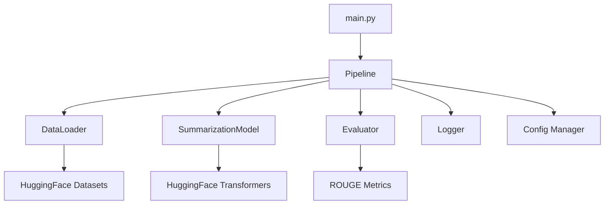

# Modular Text Summarization Pipeline

A modular, class-based Python pipeline for text summarization using self-hosted transformer models (no external APIs).  
This project demonstrates best practices in code structure, evaluation, and dataset analysis, and is designed for both research and production use.

---

## Table of Contents

- [Features](#features)
- [Architecture Overview](#architecture-overview)
  - [Component Diagram](#component-diagram)
  - [Directory Structure](#directory-structure)
- [Requirements](#requirements)
- [Installation](#installation)
- [Configuration](#configuration)
- [Usage](#usage)
  - [Summarize a Single Text](#summarize-a-single-text)
  - [Full Dataset Evaluation](#full-dataset-evaluation)
- [Inputs and Outputs](#inputs-and-outputs)
- [Logging](#logging)
- [Evaluation & Metrics](#evaluation--metrics)
- [Design Choices & Insights](#design-choices--insights)
- [Troubleshooting & FAQ](#troubleshooting--faq)
- [Limitations & Next Steps](#limitations--next-steps)
- [Acknowledgements](#acknowledgements)
- [License](#license)

---

## Features

- **Self-hosted Summarization**: Uses open-source models (BART, T5, etc.) via HuggingFace Transformers.
- **Modular Design**: Clean separation of data loading, preprocessing, modeling, evaluation, and orchestration.
- **Dataset Support**: Out-of-the-box support for the [SAMSum dialogue summarization dataset](https://huggingface.co/datasets/samsum).
- **Evaluation**: Automatic ROUGE scoring, best/worst example analysis, and output saving.
- **CLI**: Summarize a single text or run full dataset evaluation from the command line.
- **Extensible**: Easily swap models, datasets, or add new evaluation metrics.
- **Logging**: Detailed logs for every step, including errors and performance.
- **Configurable**: All parameters are managed via a YAML config file.

---

## Architecture Overview

This project is built with a focus on modularity, maintainability, and extensibility. Each major function is encapsulated in its own class, and the pipeline is orchestrated through a central runner.

### Component Diagram



## Directory Structure
```
text-summarization-pipeline/
├── config/
│   └── config.yaml
├── src/
│   ├── data_loader.py
│   ├── model.py
│   ├── pipeline.py
│   ├── evaluator.py
│   └── utils/
│       ├── logger.py
│       └── config_manager.py
├── main.py
├── requirements.txt
├── README.md
└── output/
    ├── metrics.json
    ├── examples.json
    └── examples.txt
```
## Quickstart

### 1. Install Dependencies

```pip install -r requirements.txt```


### 2. Download the Dataset

The pipeline will automatically download the [SAMSum dataset](https://huggingface.co/datasets/samsum) on first run.

### 3. Run the Pipeline

#### Summarize a Single Text

```python main.py --text "Alice: Hi Bob! How are you? Bob: I'm good, thanks! And you?" --output_dir output```

#### Full Dataset Evaluation

```python main.py --config config/config.yaml --output_dir output```
---

## Output

- **Console**: Key metrics, best/worst examples, and insights.
- **Files in `output/`**:
  - `metrics.json`: ROUGE scores and summary statistics.
  - `examples.json`: Best and worst example details.
  - `examples.txt`: Human-readable best/worst examples.

---

## Configuration

Edit `config/config.yaml` to change:
- Model (e.g., `facebook/bart-large-cnn`, `t5-base`)
- Dataset columns
- Preprocessing/generation parameters
- Number of evaluation samples

---

## Example Results

Evaluation Results:
```
Average ROUGE-1: 0.3318
Average ROUGE-2: 0.1064
Average ROUGE-L: 0.2456
Average generated summary length: 31.1 words
Average reference summary length: 20.2 words
```

---

## Design Choices & Insights

- **Class-based structure** for maintainability and extensibility.
- **Original text columns preserved** for accurate evaluation.
- **Separation of concerns**: Each module handles a single responsibility.
- **Evaluation**: Both quantitative (ROUGE) and qualitative (best/worst examples) analysis.
- **Logging**: All steps are logged for reproducibility and debugging.

---

## Limitations & Next Steps

- **Model**: No fine-tuning; only inference with pre-trained weights.
- **Evaluation**: ROUGE only; could add BERTScore or human evaluation.
- **Scalability**: For large datasets/models, consider batching and GPU optimization.
- **Extensibility**: Add support for more datasets, models, or custom training.

---

## Acknowledgements

- [HuggingFace Transformers](https://github.com/huggingface/transformers)
- [SAMSum Dataset](https://huggingface.co/datasets/samsum)

---

## License

MIT License

---

**Questions or suggestions?**  
Open an issue or contact the maintainer.
